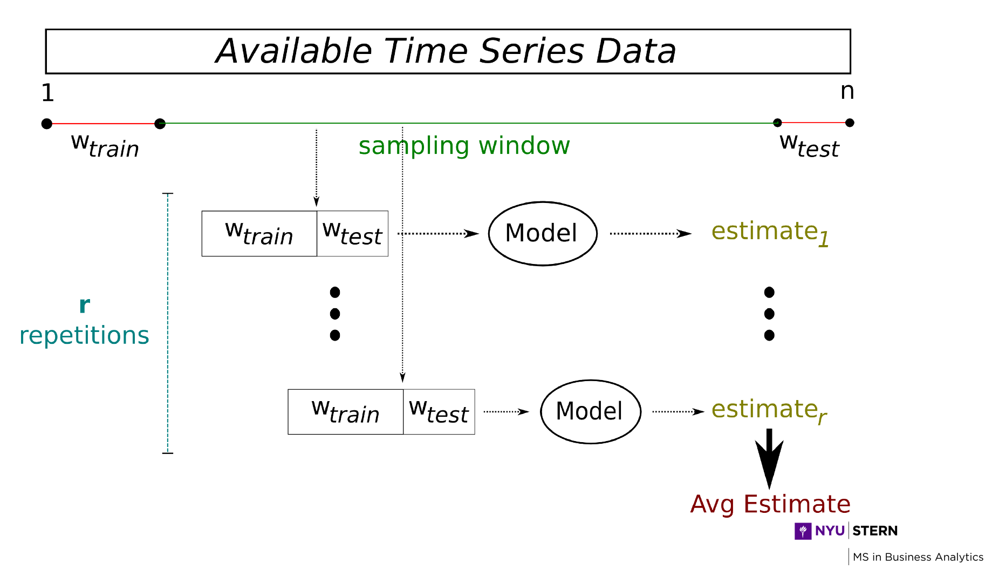

```{r, echo=FALSE, warning=FALSE, message=FALSE}
## Load libraries and declare functions
library(TTR)
library(forecast)
library(rucm)
library(stringr)
library(reshape)
library(ggplot2)
library(gridExtra)
library(DMwR)
```
# Project Background and Summary
Our goal in this assignment is to predict the **demand** for certain tools (also referred to as assets) used by Schlumberger (the world's largest oilfield service company) when providing technical services to Oil & Gas operators. 

Details: 

* For this study, we have chosen to analyze three tools: Tool A, Tool B and Tool C.
* Our datasets includes daily demand history for these tools starting in 2012.
* First, we go through the data preparation phase.
* Second, we forecast and evaluate the **daily** demand for these tools using the following UNIVARIATE time series forecasting techniques:
    + Holt-Winters
    + Auto ARIMA
    + Auto ARIMA including Fourier Analysis 
* Third, we forecast and evaluate the **monthly** demand for these tools using the following MULTIVARIATE data analysis techniques:
    + SVM
    + Random Forest
    + MARS
  

# Data Preparation
The first step of the analysis is to examine the dataset. Here we define some utility functions to load the data.

### Define utility functions and load data
```{r}
loadDemandTimeSeries <- function(fileName, type = "DF"){
  
  toolDemandData <- read.csv(fileName)
  toolDemandData$Date <- as.Date(
    str_replace_all(paste(toolDemandData$Year, "-", toolDemandData$Month, "-", toolDemandData$Day), " ", ""),
    format = "%Y-%m-%d")
  
  toolDemandData <- toolDemandData[,c(5,4)]
  
  return(toolDemandData)
}

# Load data as Dataframe
toolDemand <- merge(x = loadDemandTimeSeries("./Data/toola_dd.csv"), 
                 y = loadDemandTimeSeries("./Data/toolb_dd.csv"), 
                 by = "Date", 
                 all = TRUE)

toolDemand <- merge(x = toolDemand, 
                 y = loadDemandTimeSeries("./Data/toolc_dd.csv"), 
                 by = "Date", 
                 all = TRUE)
names(toolDemand)[2:4] <- c("toolA","toolB","toolC")
```

### Unknown data points handling
Looking at the plot below, we can see that there are some missing data in the datasets. In particular, as highlighted by the rectangle, we notice a large data gap for the month of March 2016. 

```{r fig.width=12, warning=FALSE}
# Plot data
p <- ggplot(melt(toolDemand, id.vars = "Date"), aes(x = Date, y = value,  colour = variable)) +
  ylab ("Demand") +
  geom_line() + 
  theme_minimal()

rect <- data.frame(xmin=as.Date('2016-02-01'), xmax=as.Date('2016-04-28'), ymin=-Inf, ymax=Inf)

p + geom_rect(data = rect, aes(xmin=xmin, xmax=xmax, ymin=ymin, ymax=ymax), color = 'black',alpha = 0.1, inherit.aes = FALSE)

```

#### Decomposing Time Series
From domain knowledge, we know that there are seasonality properties embedded in our dataset, we can choose either omit the unknown data or we can fill the data for March of 2016 with stastical centrality. 

To determine the appropriate strategy of handling missing data, we apply a simple moving averages decomposition to the dataset.
```{r fig.width=12, warning=FALSE}
# Load data as TS data type
startDate <- c(as.numeric(format(toolDemand$Date[[1]], "%Y")), as.numeric(format(toolDemand$Date[[1]], "%m")))

toolA_TS <- ts(na.omit(toolDemand$toolA), frequency = 365.25, start = startDate)
plot(decompose(toolA_TS))

toolB_TS <- ts(na.omit(toolDemand$toolB), frequency = 365.25, start = startDate)
plot(decompose(toolB_TS))

toolC_TS <- ts(na.omit(toolDemand$toolC), frequency = 365.25, start = startDate)
plot(decompose(toolC_TS))
```

From observation of the "random" composition, we can see that a simple seasonality decomposition using moving averages might not be sufficient to isolate seasonality from the dataset. Multiple seasonal periods could exist in the data during the year.

Since what we are attempting to achieve is to provide a high level demand forcast, we chose to omit missing data for the unknown values 

#### Omit unknown Data and prepare training and holdout data set
```{r fig.width=12, warning=FALSE}
# Fill-in NA data for March 2016
toolDemand$toolA[toolDemand$Date >= as.Date("2016-03-01") & toolDemand$Date < as.Date("2016-04-01")] <- NA
toolDemand$toolB[toolDemand$Date >= as.Date("2016-03-01") & toolDemand$Date < as.Date("2016-04-01")] <- NA
toolDemand$toolC[toolDemand$Date >= as.Date("2016-03-01") & toolDemand$Date < as.Date("2016-04-01")] <- NA

# Omit missing data
toolDemand <- na.omit(toolDemand)

# Plot data
p <- ggplot(melt(toolDemand, id.vars = "Date"), aes(x = Date, y = value,  colour = variable)) +
  ylab ("Demand") +
  geom_line() + 
  theme_minimal()

rect <- data.frame(xmin=as.Date('2016-02-01'), xmax=as.Date('2016-04-28'), ymin=-Inf, ymax=Inf)

p + geom_rect(data = rect, aes(xmin=xmin, xmax=xmax, ymin=ymin, ymax=ymax), color = 'black', alpha = 0.1, inherit.aes = FALSE)

# Setup training data and holdout data
# Use 365 days of data to train for 10 days forecast
forecastDate <- toolDemand$Date[(length(toolDemand$Date)-10)]

trainData <- tail(subset(toolDemand, Date < forecastDate), n = 365)
holdoutData <- head(subset(toolDemand, Date >= forecastDate), n = 10)
```


# Forecasting Asset Demand using Univariate Time Series Analysis

### Define utility functions
Here we define some utility functions for the forecast plot and model evaluation.

```{r}
# Plot forecast results
# Expected data structure: trainDate, trainVal are of the type "list"", forecastDF expects a data structure of "date", "actual", "forecast", "lo80", "hi80", "lo95", "hi95"
plotForecast <- function(trainDate, trainVal, forecastDF, title){
  
  plot_data <- forecastDF
  
  actual_values <- data.frame(actual = trainVal, date = trainDate, forecast=NA, lo80=NA, hi80=NA, lo95=NA, hi95=NA)
  
  plot_data <- rbind(actual_values, plot_data)
  
  p <- ggplot(plot_data) + geom_line(aes(y=actual, x=date, colour = "Actual")) + 
    geom_line(aes(y=forecast, x=date, colour = "forecast")) + 
    geom_ribbon(aes(ymin=lo80, ymax=hi80, x=date, fill = "80% confidence"), alpha = 0.3) +
    geom_ribbon(aes(ymin=lo95, ymax=hi95, x=date, fill = "95% confidence"), alpha = 0.1) +
    scale_colour_manual(values = c("deepskyblue2", "black")) +
    scale_fill_manual(values = c("red", "tomato")) +
    theme(legend.position = "right") +
    labs(title = paste(title, "- RMSE: ", round(calculateRMSE(forecastDF$actual, forecastDF$forecast), digits = 4)),
         x= paste(length(trainDate), "days actual value vs.", nrow(forecastDF),"days forecast"),
         y = "Demand")
  
  return(p)
}

# Calculate RMSE - actualValues & forecastValues should be a list
calculateRMSE <- function(actualValues, forecastValues){
  return(sqrt( mean( (forecastValues-actualValues)^2) ))
}


# Model simulation for performance evaluation
# The data frame returned conform with a data structure of "date", "actual", "forecast", "lo80", "hi80", "lo95", "hi95"
modelEvalSimulation <- function(modelName, repetitions = 10){
  
  rmseA <- c()
  rmseB <- c()
  rmseC <- c()
  
  for (i in 1:repetitions){
    
    sampleDate <- sample(toolDemand$Date[366:(length(toolDemand$Date)-10)], size = 1)
    sampleTrain <- tail(subset(toolDemand, Date < sampleDate), n = 365)
    sampleTest <- head(subset(toolDemand, Date >= sampleDate), n = 10)
    
    if (modelName == 'HoltWinters') {
      
      forecastA <- hwForecast(sampleTrain$toolA, sampleTest$toolA, sampleTest$Date)
      forecastB <- hwForecast(sampleTrain$toolB, sampleTest$toolB, sampleTest$Date)
      forecastC <- hwForecast(sampleTrain$toolC, sampleTest$toolC, sampleTest$Date)
      
    } else if (modelName == "ARIMA"){
      
      forecastA <- arimaForecast(sampleTrain$toolA, sampleTest$toolA, sampleTest$Date)
      forecastB <- arimaForecast(sampleTrain$toolB, sampleTest$toolB, sampleTest$Date)
      forecastC <- arimaForecast(sampleTrain$toolC, sampleTest$toolC, sampleTest$Date)
      
    } else if (modelName == "ARIMA-F"){
      
      forecastA <- arimaFourierForecast(sampleTrain$toolA, sampleTest$toolA, sampleTest$Date)
      forecastB <- arimaFourierForecast(sampleTrain$toolB, sampleTest$toolB, sampleTest$Date)
      forecastC <- arimaFourierForecast(sampleTrain$toolC, sampleTest$toolC, sampleTest$Date)
      
    } else {
      stop(paste(modelName, ' should be HoltWinters, ARIMA or ARIMA-F'))
    }
    
    # Calculate RMSE forecast error
      rmseA[i] <- calculateRMSE(forecastA$actual, forecastA$forecast)
      rmseB[i] <- calculateRMSE(forecastB$actual, forecastB$forecast)
      rmseC[i] <- calculateRMSE(forecastC$actual, forecastC$forecast)
  }
  
  rmseDF <- data.frame(rmseA = rmseA, rmseB = rmseB, rmseC = rmseC)
  
  print(paste("Tool A forecast simulations:", modelName, "- Average RMSE:", round(mean(rmseA), digits = 4), "| Standard Deviation:", round(sd(rmseA), digits = 4) ))
  print(paste("Tool B forecast simulations:", modelName, "- Average RMSE:", round(mean(rmseB), digits = 4), "| Standard Deviation:", round(sd(rmseB), digits = 4) ))
  print(paste("Tool C forecast simulations:", modelName, "- Average RMSE:", round(mean(rmseC), digits = 4), "| Standard Deviation:", round(sd(rmseC), digits = 4) ))
  
  return(rmseDF)
}
```


## Forecast model with HoltWinters method
We first attempt to build forecast models with HoltWinters method.

* Our objective is to provide 10 days of demand forecast. 
* We will use one year of data to train the models. 
* We only care about seasonality properties that might affect the next 10 days forecast, to limit the effect of long term multiple seasonality over the past year. 
* We treat every 10 days as a time unit as we train the models and we holdback the last 10 days of actual data for prediction comparison

#### Define functions for HoltWinters forecasting
```{r}
# Forecast with HoltWinters
hwForecast <- function(trainList, testList, testDate){
  
  # We treat every 10 days as a unit of time: frequency = 10
  train_TS <- ts(trainList, frequency = 10)
  
  ts_model <- HoltWinters(train_TS)
  
  ts_forecast <- forecast.HoltWinters(ts_model, h=10)
  
  # rename dataframe columns
  forecast_values <- as.data.frame(ts_forecast)
  forecast_values$actual <- testList
  forecast_values$date <- testDate
  forecast_values <- forecast_values[, c(7,6,1,2:5)]
  names(forecast_values) <- c("date", "actual", "forecast", "lo80", "hi80", "lo95", "hi95")
  return(forecast_values)
    
}
```

#### Forecast demand for the last 10 days and compare to the actual values 
```{r fig.height=14, fig.width=12, warning=FALSE}
# Tool A
hwforecastA <- hwForecast(trainData$toolA, holdoutData$toolA, holdoutData$Date)
pa <- plotForecast(tail(trainData$Date, n = 180), tail(trainData$toolA, n = 180), hwforecastA, "Asset A - Holt-Winters")

# Tool B
hwforecastB <- hwForecast(trainData$toolB, holdoutData$toolB, holdoutData$Date)
pb <- plotForecast(tail(trainData$Date, n = 180), tail(trainData$toolB, n = 180), hwforecastB, "Asset B - Holt-Winters")

# Tool C
hwforecastC <- hwForecast(trainData$toolC, holdoutData$toolC, holdoutData$Date)
pc <- plotForecast(tail(trainData$Date, n = 180), tail(trainData$toolC, n = 180), hwforecastC, "Asset C - Holt-Winters")

grid.arrange(pa, pb, pc, ncol= 1)
```


## Forecast model with Auto ARIMA method
Besides Holt-Winters method, ARIMA is another widely-used approache to time series forecasting. While exponential smoothing models were based on a description of trend and seasonality in the data, ARIMA models aim to describe the autocorrelations in the data. We also attempt to build a model with Auto ARIMA for our demand forcasting problem. Again we use 1 year of data to train for 10 days forecast, we holdback the last 10 days of actual data for prediction comparison

#### Define functions for Auto ARIMA forecasting
```{r}
# Forecast with Auto ARIMA
arimaForecast <- function(trainList, testList, testDate){
  
  train_TS <- ts(trainList, frequency = 365)
  
  ts_model <- auto.arima(train_TS)
  
  ts_forecast <- forecast.Arima(ts_model, h=10)
  
  # rename dataframe columns
  forecast_values <- as.data.frame(ts_forecast)
  forecast_values$actual <- testList
  forecast_values$date <- testDate
  forecast_values <- forecast_values[, c(7,6,1,2:5)]
  names(forecast_values) <- c("date", "actual", "forecast", "lo80", "hi80", "lo95", "hi95")
  return(forecast_values)
    
}

```

#### Forecast demand for the last 10 days and compare to the actual values 
```{r fig.height=14, fig.width=12, warning=FALSE}
# Tool A
arforecastA <- arimaForecast(trainData$toolA, holdoutData$toolA, holdoutData$Date)
pa <- plotForecast(tail(trainData$Date, n = 180), tail(trainData$toolA, n = 180), arforecastA, "Asset A - ARIMA")

# Tool B
arforecastB <- arimaForecast(trainData$toolB, holdoutData$toolB, holdoutData$Date)
pb <- plotForecast(tail(trainData$Date, n = 180), tail(trainData$toolB, n = 180), arforecastB, "Asset B - ARIMA")

# Tool C
arforecastC <- arimaForecast(trainData$toolC, holdoutData$toolC, holdoutData$Date)
pc <- plotForecast(tail(trainData$Date, n = 180), tail(trainData$toolC, n = 180), arforecastC, "Asset C - ARIMA")

grid.arrange(pa, pb, pc, ncol= 1)
```


## Forecast model with ARIMA and long seasonal periods using Fourier Series approach
Another option is to evaluate if considering long term multiple seasonality would improve model accuracy. 

* Fourier terms are useful for handling long term non-integer seasonality. 
* We select the number of Fourier terms by minimizing the AICc. 
* The order of the ARIMA model is also selected by minimizing the AICc, which is done within the auto.arima() function.

#### Define functions for Auto ARIMA forecasting using Fourier series
```{r}
# Forecast with Auto ARIMA using Fourier series
arimaFourierForecast <- function(trainList, testList, testDate){
  
  train_TS <- ts(trainList, frequency = 365)
  
  bestfit <- list(aicc=Inf)
  kVal = 1
  
  for(i in 1:4){
    ts_model <- auto.arima(train_TS, xreg=fourier(train_TS, K=i), seasonal=FALSE)
    if(ts_model$aicc < bestfit$aicc){
      bestfit <- ts_model
      kVal = i
    } else {
      break
    }
  }
  
  ts_forecast <- forecast.Arima(bestfit, h=10, xreg = fourier(train_TS, K = kVal, h = 10))
  
  # rename dataframe columns
  forecast_values <- as.data.frame(ts_forecast)
  forecast_values$actual <- testList
  forecast_values$date <- testDate
  forecast_values <- forecast_values[, c(7,6,1,2:5)]
  names(forecast_values) <- c("date", "actual", "forecast", "lo80", "hi80", "lo95", "hi95")
  return(forecast_values)
    
}

```

#### Forecast demand for the last 10 days and compare to the actual values 
```{r fig.height=14, fig.width=12, warning=FALSE}
# Tool A
arFourForecastA <- arimaFourierForecast(trainData$toolA, holdoutData$toolA, holdoutData$Date)
pa <- plotForecast(tail(trainData$Date, n = 180), tail(trainData$toolA, n = 180), arFourForecastA, "Asset A - Fourier Series ARIMA")

# Tool B
arFourForecastB <- arimaFourierForecast(trainData$toolB, holdoutData$toolB, holdoutData$Date)
pb <- plotForecast(tail(trainData$Date, n = 180), tail(trainData$toolB, n = 180), arFourForecastB, "Asset B - Fourier Series ARIMA")

# Tool C
arFourForecastC <- arimaFourierForecast(trainData$toolC, holdoutData$toolC, holdoutData$Date)
pc <- plotForecast(tail(trainData$Date, n = 180), tail(trainData$toolC, n = 180), arFourForecastC, "Asset C - Fourier Series ARIMA")

grid.arrange(pa, pb, pc, ncol= 1)
```


# Model Evaluation and Selection

As shown before, many methods are available for modeling time series datasets. However, in most cases, it is almost impossible to know in advance which method will be the most effective for a given dataset. Thus, a common approach to time series analysis involves trying several modeling techniques on a given dataset and evaluating how well they explain the past behavior of the time series variable, which is precisely what we will do in the following sections.

In order to evaluate the performance of the three forecasting methods (Holt-Winters, ARIMA and ARIMA with Fourier series), we will apply the "Sliding Window" test strategy combined with Monte Carlo Simulation to determine the best method suitable for our three different time series datasets.





### Holt-Winters Model Evaluation with Monte Carlo Simulation
```{r warning=FALSE}
# It takes a very long time to run 400 simulations, therefore we will provide the final results as shown below.
# modelEvalSimulation(modelName = 'HoltWinters', repetitions = 400)
hwSimRMSE <- modelEvalSimulation(modelName = 'HoltWinters')

hwSimRMSE.melt <- hwSimRMSE
hwSimRMSE.melt$id <- row.names(hwSimRMSE)
hwSimRMSE.melt <- melt(hwSimRMSE.melt, id.vars ='id')

hwplot <- ggplot(hwSimRMSE.melt, aes(variable, value)) + geom_boxplot() + labs(x= "Holt-Winters RMSE Box Plot")
```

#### Model Performance Evaluation with 400-run simulation
* "Tool A forecast simulations: HoltWinters - Average RMSE: 3.33741649909614 | Standard Deviation: 1.18681771784706"
* "Tool B forecast simulations: HoltWinters - Average RMSE: 4.2672146026078  | Standard Deviation: 1.99440471316052"
* "Tool C forecast simulations: HoltWinters - Average RMSE: 2.62449559531549 | Standard Deviation: 1.11667451962813"


### ARIMA Model Evaluation with Monte Carlo Simulation
```{r warning=FALSE}
# It takes a very long time to run 400 simulations, therefore we will provide the final results as shown below.
# modelEvalSimulation(modelName = 'ARIMA', repetitions = 400)
arSimRMSE <- modelEvalSimulation(modelName = 'ARIMA')

arSimRMSE.melt <- arSimRMSE
arSimRMSE.melt$id <- row.names(arSimRMSE)
arSimRMSE.melt <- melt(arSimRMSE.melt, id.vars ='id')

arplot <- ggplot(arSimRMSE.melt, aes(variable, value)) + geom_boxplot() + labs(x= "ARIMA RMSE Box Plot")
```

#### Model Performance Evaluation with 400-run simulation
* "Tool A forecast simulations: ARIMA - Average RMSE: 2.83590749323602 | Standard Deviation: 1.05061674368754"
* "Tool B forecast simulations: ARIMA - Average RMSE: 4.1978632740685  | Standard Deviation: 2.43524243237587"
* "Tool C forecast simulations: ARIMA - Average RMSE: 2.14420930959019 | Standard Deviation: 0.933491116431955"


### ARIMA - Fourier Series Model evaluation with Monte Carlo Simulation
```{r warning=FALSE}
# It takes a very long time to run 400 simulations, therefore we will provide the final results as shown below.
# modelEvalSimulation(modelName = 'ARIMA-F', repetitions = 400)
arfSimRMSE <- modelEvalSimulation(modelName = 'ARIMA-F')

arfSimRMSE.melt <- arfSimRMSE
arfSimRMSE.melt$id <- row.names(arfSimRMSE)
arfSimRMSE.melt <- melt(arfSimRMSE.melt, id.vars ='id')

arfplot <- ggplot(arfSimRMSE.melt, aes(variable, value)) + geom_boxplot() + labs(x= "ARIMA-F RMSE Box Plot")
```

#### Model Performance Evaluation with 400-run simulation
* "Tool A forecast simulations: ARIMA-F - Average RMSE: 3.05998330235121 | Standard Deviation: 1.41270094672959"
* "Tool B forecast simulations: ARIMA-F - Average RMSE: 4.53733544287684 | Standard Deviation: 2.29227052909499"
* "Tool C forecast simulations: ARIMA-F - Average RMSE: 2.58895442897083 | Standard Deviation: 1.23838410325111"

```{r fig.width=12, warning=FALSE}
grid.arrange(hwplot, arplot, arfplot, nrow= 1)
```

## Automatic Model Selection
Once we have obtained the RMSE value from each model performance simulation as shown previously, we can automatically select the best model to forecast the demand for each asset based on the lowest RMSE value. This can be generalized to develop automatic model selection for asset optimization as part of our Capstone Project. 

```{r}
simRmseDfList <- list()
simRmseDfList$HoltWinters <- hwSimRMSE
simRmseDfList$ARIMA <- arSimRMSE
simRmseDfList$ARIMAF <- arfSimRMSE


selectBestModel <- function(simRmseDfList){
  
  bestModel = data.frame(BestModel=character(), RMSE=integer(), stringsAsFactors=FALSE)
  
  for(i in 1:length(simRmseDfList)){
    modelName = names(simRmseDfList[i])
    
    if ((exists('aAvgRMSE') == FALSE) || aAvgRMSE > mean(simRmseDfList[[i]]$rmseA)) {
      aAvgRMSE <- mean(simRmseDfList[[i]]$rmseA)
      bestModel[1,1] <- as.character(modelName)
      bestModel[1,2] <- aAvgRMSE
    }
    
    
    if ((exists('bAvgRMSE') == FALSE) || bAvgRMSE > mean(simRmseDfList[[i]]$rmseB)) {
      bAvgRMSE <- mean(simRmseDfList[[i]]$rmseB)
      bestModel[2,1] <- as.character(modelName)
      bestModel[2,2] <- bAvgRMSE
    }
    
    if ((exists('cAvgRMSE') == FALSE) || cAvgRMSE > mean(simRmseDfList[[i]]$rmseC)) {
      cAvgRMSE <- mean(simRmseDfList[[i]]$rmseC)
      bestModel[3,1] <- as.character(modelName)
      bestModel[3,2] <- cAvgRMSE
    }
    
  }
  
  row.names(bestModel) <- c("ToolA", "ToolB", "ToolC")
  return(bestModel)
}

selectBestModel(simRmseDfList)
```


# Forecasting Asset Demand using MULTIVARIATE Data Analysis
```{r}
# Load Multivariate Data
loadMultivariateTimeSeries <- function(fileName){
  
  toolDemandData <- read.csv(fileName)
  toolDemandData$Date <- as.Date(str_replace_all(paste(toolDemandData$Year, "-", toolDemandData$Month, "-1"), " ", ""))
  
  toolDemandData <- na.omit(toolDemandData[,c(9,3:8)])
  
  return(toolDemandData)
}

plotMultivariateTimeSeries <- function(plot.data, assetName, modelName){
  
  plot.data.melt <- melt(plot.data, id.vars = 'Date')
  
  # Plot actual vs. forecast
  p <- ggplot(plot.data.melt, aes(x = Date, y = value, color = variable)) + geom_line() +
    labs(title = paste(assetName, modelName, "- RMSE: ", round(calculateRMSE(plot.data$actual, plot.data$predict), digits = 4)),x = "Date", y = "Demand")

  return(p)
}

# Load data as Dataframe
toolDemandwp <- loadMultivariateTimeSeries("./Data/predictors.csv")
str(toolDemandwp)
```

### Evaluate correlation between predictors and target variables
```{r echo=FALSE, warning=FALSE, message=FALSE}
library(polycor)
hetcor(toolDemandwp[,-1])
```

### Prepare data for demand forcast
In order to develop a forecasting model with multiple independent variables:

* We need to map the demand for **next month** with the econometrics data of the **current month** to train our forecast model. 
* We create a new data frame by shifting the next month demand to current month data points. 
* A random sampling of 70% of data is created for training and the remaining 30% of data is used for model testing.
```{r warning=FALSE, message=FALSE}
library(quantmod)
# Create variables representing the future demand of next month as our new dependent variable for model trainning
toolDemandwp$next.month.a <- Next(toolDemandwp$tool.a)
toolDemandwp$next.month.b <- Next(toolDemandwp$tool.b)
toolDemandwp$next.month.c <- Next(toolDemandwp$tool.c)

# Remove NA - for the last months of data we don't know about the future
toolDemandwp <- na.omit(toolDemandwp)

# Random sampling and separate training and testing data set
set.seed(1234)
trPerc <- 0.7
sp <- sample(1:nrow(toolDemandwp), as.integer(nrow(toolDemandwp)*trPerc))
trainset <- toolDemandwp[sp,]
testset <- toolDemandwp[-sp,]
```


### SVM Model - use next month demand as depdendent variable
```{r warning=FALSE, message=FALSE}
library(e1071)
# Define the function for SVM training
# Expected data structure: tool.train, tool.test are data frame with a data structure of "dependent variable", "independent variables..."
buildSvmModel <- function(tool.train, tool.test){
  tool.all <- rbind(tool.train, tool.test)
  f <- as.formula(paste(names(tool.all)[1], "~", paste(colnames(tool.all)[2 :ncol(tool.all)], collapse = "+")))

  # Find the best paramters for SVM model using all data
  best.svm.param <- tune.svm(f, data = tool.all, gamma = seq(0.5,3.0, by=0.1), cost = seq(100,1000, by = 100)) 
  print(best.svm.param)
  
  c <- best.svm.param$best.model$cost
  g <- best.svm.param$best.model$gamma
  
  svm.model <- svm(f, data = tool.train, cost = c, gamma = g)
  
  # applying model to test data
  svm.test.pred <- predict(svm.model, newdata = tool.test[,c(2 :ncol(tool.test))])
  
  # Compare test result and Calculate RMSE
  svm.compare <- data.frame(actual = tool.test[,c(names(tool.test)[1])], predict = svm.test.pred)
  
  return(svm.model)
}
```

#### Forecasting Asset Demand
```{r}
#### Build Model Asset A ####
svm.model.a <- buildSvmModel(trainset[,c(5,2:4)], testset[,c(5,2:4)])

# Compare test vs actual for entire time serie and calculate RMSE
svm.all.pred.a <- predict(svm.model.a, toolDemandwp[,c("us.price","us.rig","us.prod")])  

# Prepare data for plotting
svm.all.compare.a <- data.frame(actual = toolDemandwp[,c("tool.a")], predict = svm.all.pred.a)
svm.all.compare.a$Date <- toolDemandwp$Date
p.svm.a <- plotMultivariateTimeSeries(svm.all.compare.a, "Asset A", "SVM")


#### Build Model Asset B ####
svm.model.b <- buildSvmModel(trainset[,c(6,2:4)], testset[,c(6,2:4)])

# Compare test vs actual for entire time serie and calculate RMSE
svm.all.pred.b <- predict(svm.model.b, toolDemandwp[,c("us.price","us.rig","us.prod")])  

# Prepare data for plotting
svm.all.compare.b <- data.frame(actual = toolDemandwp[,c("tool.b")], predict = svm.all.pred.b)
svm.all.compare.b$Date <- toolDemandwp$Date
p.svm.b <- plotMultivariateTimeSeries(svm.all.compare.b, "Asset B", "SVM")


#### Build Model Asset C ####
svm.model.c <- buildSvmModel(trainset[,c(7,2:4)], testset[,c(7,2:4)])

# Compare test vs actual for entire time serie and calculate RMSE
svm.all.pred.c <- predict(svm.model.c, toolDemandwp[,c("us.price","us.rig","us.prod")])  

# Prepare data for plotting
svm.all.compare.c <- data.frame(actual = toolDemandwp[,c("tool.c")], predict = svm.all.pred.c)
svm.all.compare.c$Date <- toolDemandwp$Date
p.svm.c <- plotMultivariateTimeSeries(svm.all.compare.c, "Asset C", "SVM")
```

```{r fig.height=8, fig.width=12, warning=FALSE}
grid.arrange(p.svm.a, p.svm.b, p.svm.c, ncol= 1)

#### Forecast for next month ####
last.monthly <- toolDemandwp[nrow(toolDemandwp), 2:4]
next.month.pred.a <- predict(svm.model.a, last.monthly)
next.month.pred.b <- predict(svm.model.b, last.monthly) 
next.month.pred.c <- predict(svm.model.c, last.monthly) 

print(paste("Next Month Forecast: Asset A -", round(next.month.pred.a, digits = 2), "| Asset B -", round(next.month.pred.b, digits = 2), "| Asset C -", round(next.month.pred.c, digits = 2)))
```


### Random Forest Model - use next month demand as depdendent variable
```{r warning=FALSE, message=FALSE}
library(randomForest)
# Define the function for Random Forest training
# Expected data structure: tool.train, tool.test are data frame with a data structure of "dependent variable", "independent variables..."
buildRandomForestModel <- function(tool.train, tool.test){

  f <- as.formula(paste(names(tool.train)[1], "~", paste(colnames(tool.train)[2 :ncol(tool.train)], collapse = "+")))

  rf.model <- randomForest(f, data = tool.train)
  
  # applying model to test data
  rf.test.pred <- predict(rf.model, newdata = tool.test[,c(2 :ncol(tool.test))])
  
  # Compare test result and Calculate RMSE
  rf.compare <- data.frame(actual = tool.test[,c(names(tool.test)[1])], predict = rf.test.pred)
  
  return(rf.model)
}
```

#### Forecasting Asset Demand
```{r}
#### Build Model Asset A ####
rf.model.a <- buildRandomForestModel(trainset[,c(5,2:4)], testset[,c(5,2:4)])

# Compare test vs actual for entire time serie and calculate RMSE
rf.all.pred.a <- predict(rf.model.a, toolDemandwp[,c("us.price","us.rig","us.prod")])  

# Prepare data for plotting
rf.all.compare.a <- data.frame(actual = toolDemandwp[,c("tool.a")], predict = rf.all.pred.a)
rf.all.compare.a$Date <- toolDemandwp$Date
p.rf.a <- plotMultivariateTimeSeries(rf.all.compare.a, "Asset A", "Random Forest")

#### Build Model Asset B ####
rf.model.b <- buildRandomForestModel(trainset[,c(6,2:4)], testset[,c(6,2:4)])

# Compare test vs actual for entire time serie and calculate RMSE
rf.all.pred.b <- predict(rf.model.b, toolDemandwp[,c("us.price","us.rig","us.prod")])  

# Prepare data for plotting
rf.all.compare.b <- data.frame(actual = toolDemandwp[,c("tool.b")], predict = rf.all.pred.b)
rf.all.compare.b$Date <- toolDemandwp$Date
p.rf.b <- plotMultivariateTimeSeries(rf.all.compare.b, "Asset B", "Random Forest")


#### Build Model Asset C ####
rf.model.c <- buildRandomForestModel(trainset[,c(7,2:4)], testset[,c(7,2:4)])

# Compare test vs actual for entire time serie and calculate RMSE
rf.all.pred.c <- predict(rf.model.c, toolDemandwp[,c("us.price","us.rig","us.prod")])  

# Prepare data for plotting
rf.all.compare.c <- data.frame(actual = toolDemandwp[,c("tool.c")], predict = rf.all.pred.c)
rf.all.compare.c$Date <- toolDemandwp$Date
p.rf.c <- plotMultivariateTimeSeries(rf.all.compare.c, "Asset C", "Random Forest")
```

```{r fig.height=8, fig.width=12, warning=FALSE}
grid.arrange(p.rf.a, p.rf.b, p.rf.c, ncol= 1)

#### Forecast for next month ####
last.monthly <- toolDemandwp[nrow(toolDemandwp), 2:4]
next.month.pred.a <- predict(rf.model.a, last.monthly)
next.month.pred.b <- predict(rf.model.b, last.monthly) 
next.month.pred.c <- predict(rf.model.c, last.monthly) 

print(paste("Next Month Forecast: Asset A -", round(next.month.pred.a, digits = 2), "| Asset B -", round(next.month.pred.b, digits = 2), "| Asset C -", round(next.month.pred.c, digits = 2)))
```


### MARS Model - use next month demand as depdendent variable
```{r warning=FALSE, message=FALSE}
library(earth)
# Define the function for MARS training
# Expected data structure: tool.train, tool.test are data frame with a data structure of "dependent variable", "independent variables..."
buildMARSModel <- function(tool.train, tool.test){

  f <- as.formula(paste(names(tool.train)[1], "~", paste(colnames(tool.train)[2 :ncol(tool.train)], collapse = "+")))

  mars.model <- earth(f, data = tool.train)
  
  # Apply model to test data
  mars.test.pred <- predict(mars.model, newdata = tool.test[,c(2 :ncol(tool.test))])
  
  # Compare test result and calculate RMSE
  mars.compare <- data.frame(actual = tool.test[,c(names(tool.test)[1])], predict = mars.test.pred)
  names(mars.compare)[2] <- "predict"
  
  return(mars.model)
}
```

#### Forecasting Asset Demand
```{r}
#### Build Model Asset A ####
mars.model.a <- buildMARSModel(trainset[,c(5,2:4)], testset[,c(5,2:4)])

# Compare test vs actual for entire time serie and calculate RMSE
mars.all.pred.a <- predict(mars.model.a, toolDemandwp[,c("us.price","us.rig","us.prod")])  

# Prepare data for plotting
mars.all.compare.a <- data.frame(actual = toolDemandwp[,c("tool.a")], predict = mars.all.pred.a)
names(mars.all.compare.a)[2] <- "predict"
mars.all.compare.a$Date <- toolDemandwp$Date
p.mars.a <- plotMultivariateTimeSeries(mars.all.compare.a, "Asset A", "MARS")


#### Build Model Asset B ####
mars.model.b <- buildMARSModel(trainset[,c(6,2:4)], testset[,c(6,2:4)])

# Compare test vs actual for entire time serie and calculate RMSE
mars.all.pred.b <- predict(mars.model.b, toolDemandwp[,c("us.price","us.rig","us.prod")])  

# Prepare data for plotting
mars.all.compare.b <- data.frame(actual = toolDemandwp[,c("tool.b")], predict = mars.all.pred.b)
names(mars.all.compare.b)[2] <- "predict"
mars.all.compare.b$Date <- toolDemandwp$Date
p.mars.b <- plotMultivariateTimeSeries(mars.all.compare.b, "Asset B", "MARS")


#### Build Model Asset C ####
mars.model.c <- buildMARSModel(trainset[,c(7,2:4)], testset[,c(7,2:4)])

# Compare test vs actual for entire time serie and calculate RMSE
mars.all.pred.c <- predict(mars.model.c, toolDemandwp[,c("us.price","us.rig","us.prod")])  

# Prepare data for plotting
mars.all.compare.c <- data.frame(actual = toolDemandwp[,c("tool.c")], predict = mars.all.pred.c)
names(mars.all.compare.c)[2] <- "predict"
mars.all.compare.c$Date <- toolDemandwp$Date
p.mars.c <- plotMultivariateTimeSeries(mars.all.compare.c, "Asset C", "MARS")
```

```{r fig.height=8, fig.width=12, warning=FALSE}
grid.arrange(p.mars.a, p.mars.b, p.mars.c, ncol= 1)

#### Forecast for next month ####
last.monthly <- toolDemandwp[nrow(toolDemandwp), 2:4]
next.month.pred.a <- predict(mars.model.a, last.monthly)
next.month.pred.b <- predict(mars.model.b, last.monthly) 
next.month.pred.c <- predict(mars.model.c, last.monthly) 

print(paste("Next Month Forecast: Asset A -", round(next.month.pred.a, digits = 2), "| Asset B -", round(next.month.pred.b, digits = 2), "| Asset C -", round(next.month.pred.c, digits = 2)))
```


## Evaluating models - Asset A
```{r, echo=FALSE, warning=FALSE, message=FALSE, results="hide"}
library(performanceEstimation)
assetDataA <- toolDemandwp[,c(5,2:4)]
names(assetDataA)[1] <- "demand"

# Find best SVM parameters
best.svm.param <- tune.svm(demand~., data = assetDataA, gamma = seq(0.5,3.0, by=0.1), cost = seq(100,1000, by = 100)) 
c <- best.svm.param$best.model$cost
g <- best.svm.param$best.model$gamma
  
perf.eva.a <- performanceEstimation(
  PredTask(demand~., assetDataA),
  c(workflowVariants("standardWF", learner="svm", learner.pars=list(cost=c,gamma=g)),
    workflowVariants("standardWF", learner=c("randomForest", "earth"))
  ),
  EstimationTask(metrics="rmse",method=CV(nReps=10,nFolds=10)))
```

```{r fig.width=12}
rankWorkflows(perf.eva.a,3)
plot(perf.eva.a)
```

* MARS is the best model for Asset A


## Evaluating models - Asset B
```{r, echo=FALSE, warning=FALSE, message=FALSE, results="hide"}
library(performanceEstimation)
assetDataB <- toolDemandwp[,c(6,2:4)]
names(assetDataB)[1] <- "demand"

# Find best SVM parameters
best.svm.param <- tune.svm(demand~., data = assetDataB, gamma = seq(0.5,3.0, by=0.1), cost = seq(100,1000, by = 100)) 
c <- best.svm.param$best.model$cost
g <- best.svm.param$best.model$gamma
  
perf.eva.b <- performanceEstimation(
  PredTask(demand~., assetDataB),
  c(workflowVariants("standardWF", learner="svm", learner.pars=list(cost=c,gamma=g)),
    workflowVariants("standardWF", learner=c("randomForest", "earth"))
  ),
  EstimationTask(metrics="rmse",method=CV(nReps=10,nFolds=10)))
```

```{r fig.width=12}
rankWorkflows(perf.eva.b,3)
plot(perf.eva.b)
```

* SVM is the best model for Asset B


## Evaluating models - Asset C
```{r, echo=FALSE, warning=FALSE, message=FALSE, results="hide"}
library(performanceEstimation)
assetDataC <- toolDemandwp[,c(7,2:4)]
names(assetDataC)[1] <- "demand"

# Find best SVM parameters
best.svm.param <- tune.svm(demand~., data = assetDataC, gamma = seq(0.5,3.0, by=0.1), cost = seq(100,1000, by = 100)) 
c <- best.svm.param$best.model$cost
g <- best.svm.param$best.model$gamma
  
perf.eva.c <- performanceEstimation(
  PredTask(demand~., assetDataC),
  c(workflowVariants("standardWF", learner="svm", learner.pars=list(cost=c,gamma=g)),
    workflowVariants("standardWF", learner=c("randomForest", "earth"))
  ),
  EstimationTask(metrics="rmse",method=CV(nReps=10,nFolds=10)))
```

```{r fig.width=12}
rankWorkflows(perf.eva.c,3)
plot(perf.eva.c)
```

* MARS is the best model for Asset C

